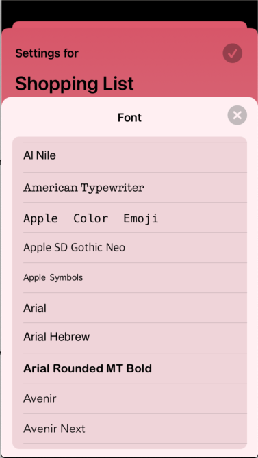

# FontPicker

A Font Picker in a similar style to Apple's Color Picker, providing a means of choosing a font from the available UIFont familyNames. I'm not 100% sure that all of these font names work in SwiftUI, but they seem to.



## Installation

### Swift Package Manager

In Xcode:
* File ⭢ Swift Packages ⭢ Add Package Dependency...
* Use the URL https://github.com/franklynw/FontPicker


## Example

> **NB:** All examples require `import FontPicker` at the top of the source file

It can be used directly as a view, which offers the full range of customisation options -

```swift
var body: some View {
    
    FontPicker(isPresented: $isFontPickerPresented, selected: $viewModel.selectedFont)
        .additionalFontNames(["MySpecialFont"])
        .excludedFontNames(["Marker Felt"])
        .backgroundColor(viewModel.fontPickerBackgroundColor)
}
```

or as a modifier, which presents the default font picker (with no customisation options) -

```swift
var body: some View {

    MyView {
    
    }
    .fontPicker(isPresented: $isFontPickerPresented, Binding: $viewModel.selectedFont)
}
```

### Specify the fonts you want to be shown

If you use this modifier, it will only show the fonts you specify

```swift
FontPicker(isPresented: $isFontPickerPresented, selected: $viewModel.selectedFont)
    .fontNames(viewModel.allTheBestFonts)
```

### Specify the fonts you'd like to add to the default list

This will show all of the available system fonts, plus any you pass in here

```swift
FontPicker(isPresented: $isFontPickerPresented, selected: $viewModel.selectedFont)
    .additionalFontNames(viewModel.myUniqueFonts)
```

### Specify the fonts you'd like to not be shown

This will show all of the available system fonts, minus any you pass in here

```swift
FontPicker(isPresented: $isFontPickerPresented, selected: $viewModel.selectedFont)
    .excludedFontNames(viewModel.rubbishFonts)
```

### Disable the automatic "dismiss on selection" functionality

This might be necessary if you have (eg) a preview visible above the picker, where you can see how your selected font looks - the user can then decide when to dismiss the picker

```swift
FontPicker(isPresented: $isFontPickerPresented, selected: $viewModel.selectedFont)
    .disableDismissOnSelection
```

### Set the picker's background colour

```swift
FontPicker(isPresented: $isFontPickerPresented, selected: $viewModel.selectedFont)
    .backgroundColor(.lightGray)
```

### Set the height of the picker as either a fixed height or as a proportion of the containing view's height

```swift
FontPicker(isPresented: $isFontPickerPresented, selected: $viewModel.selectedFont)
    .height(.fixed(400))
```

or

```swift
FontPicker(isPresented: $isFontPickerPresented, selected: $viewModel.selectedFont)
    .height(.proportional(0.6))
```

## Additionally...

There are two NotificationCenter notifications which are sent, which are defined as static vars on Notification.Name -

* fontPickerAppeared ("FontPickerAppearedNotification")
* fontPickerDisappeared ("FontPickerDisappearedNotification")

These are sent as their names suggest, and there is no additional userInfo


## Dependencies

Requires HalfASheet, which is linked. Take a look at it [here](https://github.com/franklynw/HalfASheet)


## License  

`FontPicker` is available under the MIT license
